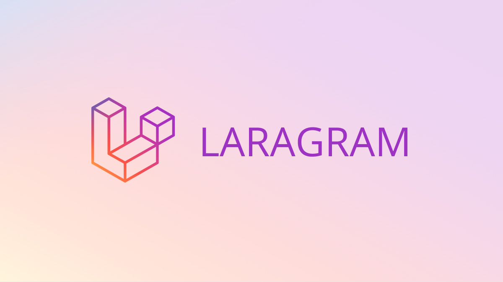
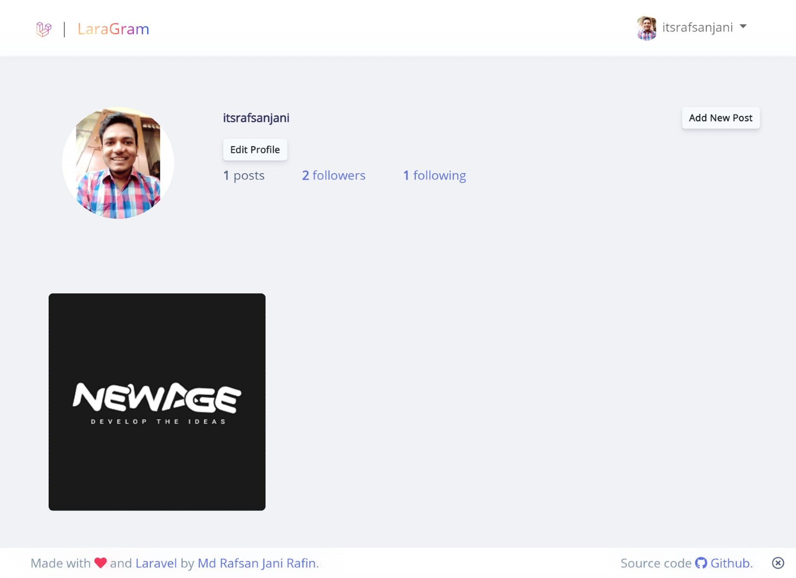
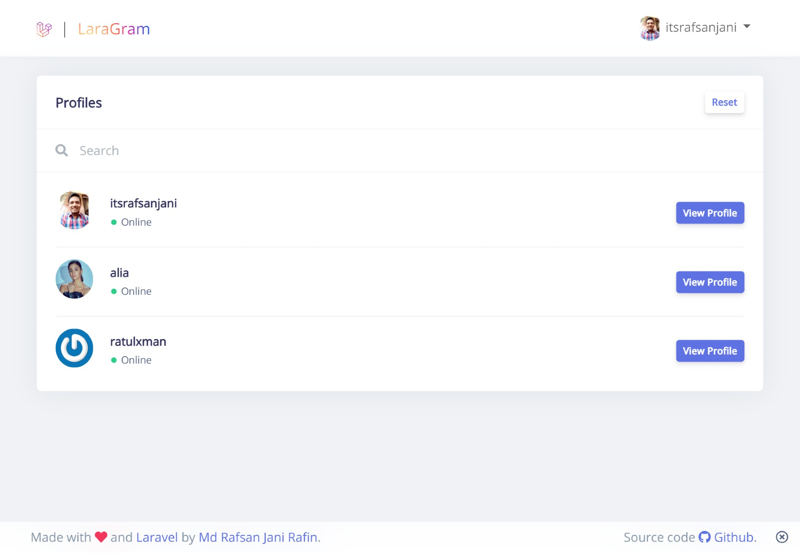
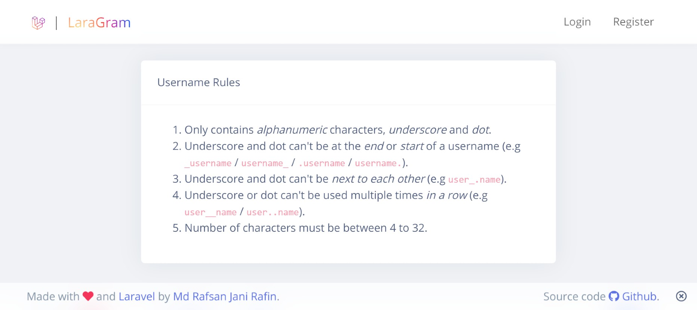

### LaraGram - Laravel Instagram Clone


> Laragram is a social media app like Instagram.

### Setup Instructions

> Clone this repository to your device and run this commands:

> Copy `.env.example` file to `.env`
```sh
cp .env.example .env
```

> Configure `.env` file with your own credentials

```sh
composer install

npm install

php artisan key:generate

php artisan migrate

npm run dev

php artisan storage:link
```

### Some Screenshots






> If you like this app don't forget to give a star! ⭐ \
> Thank You!
